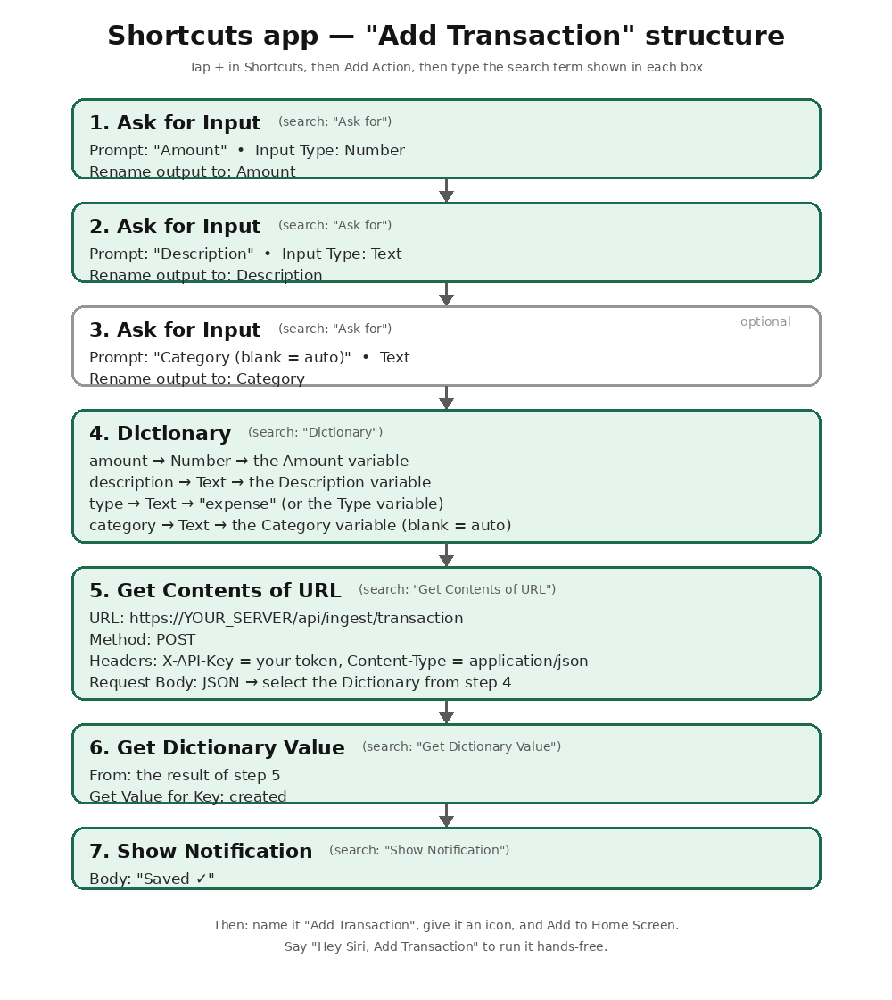

# Add transactions from iPhone — iOS Shortcut

Send a transaction to Finance Tracker straight from your iPhone/iPad/Mac using the
built-in **Shortcuts** app and the app's **ingestion API**. No App Store plugin needed —
Shortcuts *is* the plugin platform on iOS.

There are two ways to use it:

1. **Interactive** — tap the shortcut, it asks for amount + description (+ optional
   category/account), and posts it.
2. **Share Sheet / automation** — pass text (e.g. an SMS or a note) and it parses/sends it.

---

## 0. Fastest path — the in-app Setup Kit (recommended)

In the app open **API Access → iOS Shortcut integration**:

- Enter your **Server URL** (the address your *phone* can reach — a LAN IP like
  `http://192.168.1.50:8000` or an HTTPS domain, **not** `localhost`).
- Tap **Create Setup Kit**. It mints a fresh API token and shows three copy-able values:
  the POST **URL**, the **X-API-Key** value, and a minimal **JSON body**.
- Build a 3-action shortcut (Ask Amount → Ask Description → Get Contents of URL) pasting
  those three values. Full steps are shown right there and in section 3 below.

This works on **every iPhone** with no Mac and no extra settings.

> **About the "Download .shortcut file" button.** It produces a complete, correct shortcut
> with your URL + token baked in — but since **iOS 15, Apple requires shortcut files to be
> _signed_**. An unsigned file will **not** import by tapping on a stock modern iPhone
> ("Allow Untrusted Shortcuts" governs *source trust*, not signing). Import it only after
> **signing on a Mac** (see section 3a) or on iOS 12–14. On a normal iPhone, use the Setup
> Kit above instead.
>
> The **Type** picker offers **Expense / Income / Transfer**. Picking Transfer still needs
> you to also pick **"Transfer"** from the Category picker right after (there's no automatic
> link between the two prompts) — that's what the app itself uses to recognize a transfer
> record. Tick **"Ask From Account"** if you want to record where the money came from, same
> as the app's own From Account field on a transfer.

---

## 1. Get an API token (one time)

The ingestion API is authenticated with a long‑lived **API token** (not your password).

- In the app: **API Access** (left nav) → **Create token** → name it e.g. `iPhone` →
  **copy the token shown once** (it is not shown again).
- Or via the API:

  ```bash
  # Log in to get a session token, then create an API token
  curl -s -X POST http://localhost:8000/api/api-tokens/ \
    -H "Authorization: Bearer <your_session_access_token>" \
    -H "Content-Type: application/json" \
    -d '{"name":"iPhone"}'
  # -> { "id": 1, "token": "ft_XXXXXXXX...", ... }   (copy "token")
  ```

Keep this token secret — anyone with it can add transactions to your account.

> **Base URL.** Replace `http://localhost:8000` below with wherever your backend is
> reachable **from the phone**. On the same machine that's `http://localhost:8000`; from
> another device use the server's LAN IP (e.g. `http://192.168.1.50:8000`) or your public
> HTTPS domain. `localhost` on the phone points at the phone, not your server.

---

## 2. The API (what the shortcut calls)

**Endpoint:** `POST {BASE_URL}/api/ingest/transaction`
**Headers:** `X-API-Key: <your token>` and `Content-Type: application/json`

**Minimal body** (everything else is optional — date defaults to *now*, type defaults to
*expense*):

```json
{ "amount": 250, "description": "Swiggy dinner" }
```

**Full body** (all fields optional except `amount` + `description`):

```json
{
  "amount": 250,
  "description": "Swiggy dinner",
  "type": "expense",              // expense/debit or income/credit  (default: expense)
  "date": "2026-07-23T20:15:00",  // ISO 8601; default: now
  "category": "Food & Dining",    // optional; auto-set by your Automatic Rules if omitted
  "account": "HDFC 50100446113551", // account/bank NAME (case-insensitive); default: "External"
  "labels": ["food", "dinner"],   // existing label names to attach (optional)
  "reference": "TXN12345",         // optional
  "notes": "with friends"          // optional
}
```

**Friendly field aliases** (any of these work, so your shortcut input names don't matter):

| Canonical | Also accepts |
|---|---|
| `amount` | `amt`, `value`, `price`, `total` |
| `description` | `desc`, `merchant`, `payee`, `title`, `name`, `for` |
| `type` | `transaction_type`, `direction`, `kind` — values: expense/debit/spent/out/− or income/credit/received/in/+ |
| `date` | `transaction_date`, `time`, `datetime`, `timestamp`, `when` |
| `category` | `cat` |
| `account` | `bank`, `account_name`, `bank_name`, `card` |
| `labels` | `label`, `tags`, `tag` (comma string or JSON array) |
| `notes` | `memo`, `comment`, `note` |

**Response:** `201` with `{ "created": true, "transaction_id": 123 }`. Duplicates
(same account+date+amount+description) are skipped with `{ "skipped_duplicate": true }`.

**Verify the token quickly:** `GET {BASE_URL}/api/ingest/ping` with the `X-API-Key`
header returns `{ "ok": true, "user": "..." }`.

Batch endpoint (optional): `POST /api/ingest/transactions` with a JSON array or
`{ "transactions": [ ... ] }`.

---

## 3. Build the interactive shortcut (recommended)

This is the fiddliest part if you've never built a Shortcut before, since it's all done by
tapping through the Shortcuts app rather than typing commands. Here's the shape of what
you're building (7 actions, stacked top to bottom — this is a diagram of the structure, not
an actual screenshot of the app, since every iOS version's Shortcuts UI looks a little
different):



**The one mechanic you'll repeat 7 times — adding an action:**

1. Open the **Shortcuts** app → tap **+** (top-right) to start a new shortcut.
2. Tap **Add Action** (or the **+** in the middle of the empty shortcut).
3. A search bar appears at the top — **type the search term** shown in each box of the
   diagram above (e.g. type `Ask for` to find "Ask for Input").
4. Tap the matching result from the list to drop it into your shortcut.
5. Tap on the action's own fields (prompt text, dropdowns, etc.) to configure it as
   described.
6. Repeat for the next action.

**A second mechanic — "magic variables" (referencing an earlier action's output):**
Whenever a later step needs an earlier one's answer (e.g. the Dictionary step in #4 needs
the `Amount` from step #1), tap into that field and a bar of colored pill-shaped
**variables** pops up above the keyboard — tap the pill named `Amount` (or whatever you
renamed it to) to insert it. You never type these by hand.

Now, action by action:

1. **Ask for Input** — Prompt: `Amount`. Tap **Input Type** and change it from *Text* to
   **Number**. Optionally tap the little "Amount" label under the action and rename it —
   this is the pill you'll pick later.
2. **Ask for Input** — Prompt: `Description`. Leave Input Type as **Text**. Rename to
   `Description`.
3. *(optional)* **Ask for Input** — Prompt: `Category (blank = auto)`. Text. Rename to
   `Category`. Skip this action entirely if you're fine always auto-categorizing.
4. **Dictionary** — tap **Add new item** four times, and for each row: tap the key field
   and type the key name (`amount`, `description`, `type`, `category`), then tap the value
   field and either type a literal (e.g. `expense`) or tap it and pick the matching
   variable pill (`Amount` for the `amount` row, `Description` for `description`, etc.).
   For the `amount` row specifically, tap the small type icon next to the value and set it
   to **Number** instead of Text.
5. **Get Contents of URL** — tap the URL field and type
   `https://YOUR_SERVER/api/ingest/transaction`. Tap **Show More** to reveal Method/Headers/
   Request Body. Set **Method: POST**. Under **Headers**, add two rows: `X-API-Key` → your
   token, and `Content-Type` → `application/json`. Under **Request Body**, choose **JSON**,
   then tap the body field and pick the **Dictionary** variable pill from step 4.
6. **Get Dictionary Value** — tap **Get Value for Key**, type `created`. For the input, tap
   the field and select the variable pill produced by step 5 (labeled "Contents of URL").
7. **Show Notification** — tap the body field, type `Saved ✓`.

Name the shortcut **"Add Transaction"** (tap the name at the top), give it an icon, and
(optionally) **Add to Home Screen** or add it to a widget. Say *"Hey Siri, Add Transaction"*
to run it hands‑free.

> **Tip — omit empty keys.** If you leave Category/Type empty, that's fine: the server
> auto‑categorizes via your Automatic Rules and defaults the type to expense.

---

## 3a. Signing the downloaded `.shortcut` (Mac / iOS ≤14 only)

The **Download .shortcut file** button (API Access page) gives you a complete shortcut with
your URL + a fresh token baked in — but iOS 15+ only imports **signed** shortcut files. Sign
it once, then AirDrop/host the signed result and it imports by tapping.

On a **Mac** (Shortcuts installed):

```bash
shortcuts sign --mode anyone --input "Add Transaction.shortcut" --output "Add Transaction.signed.shortcut"
```

`--mode anyone` asks Apple's signing service to produce a file any device can import
(`people-who-know-me` restricts it to your contacts). Then open/AirDrop the `.signed.shortcut`.

No Mac? Use the **Setup Kit** (section 0) — it needs no signing. (There are community Linux
signers such as `0xilis/shortcut-sign`, but they're unofficial and not guaranteed to import.)

---

## 4. Share Sheet / quick‑text version

To turn a copied SMS or a bit of text into a transaction:

1. In the shortcut settings enable **Show in Share Sheet** (accept **Text**).
2. First action: **Get Text from Input** (the shared text) → `Raw`.
3. Either send it as the description and a fixed amount, or use **Match Text**
   (regex) to pull the amount, e.g. `[0-9][0-9,]*\.?[0-9]*`, then build the Dictionary as
   above with `amount` = the matched number and `description` = `Raw`.
4. **Get Contents of URL** exactly as in step 6 above.

Now from any app: **Share → Add Transaction**.

---

## 5. Test from a terminal first

Before wiring the phone, confirm the endpoint works:

```bash
curl -s -X POST http://localhost:8000/api/ingest/transaction \
  -H "X-API-Key: ft_XXexampleXX" \
  -H "Content-Type: application/json" \
  -d '{"amount": 250, "description": "Swiggy dinner"}'
# -> {"created":true,"transaction_id":123}
```

---

## 6. Troubleshooting

| Symptom | Fix |
|---|---|
| `401 Unauthorized` | Missing/incorrect `X-API-Key` header, or token revoked. Recreate it in **API Access**. |
| `422 missing/invalid fields: amount` / `description` | Those two are required; make sure the Dictionary sends them with real values. |
| Can't reach the server from the phone | Use the server's LAN IP or HTTPS domain, not `localhost`. Phone and server must be on the same network (or the server publicly reachable). |
| Transaction lands in **"External"** account | No account matched the `account` name. Send the exact account name (see the Accounts page) or leave it out. |
| Wrong/blank category | Add/adjust a rule in **Settings → Automatic Rules** (keyword → category), or send `category` explicitly. |
| Amount sign | Send `type: "income"` for money in; otherwise it's recorded as an expense. |

---

## Notes

- Ingested transactions appear everywhere in the app (Records, Analytics, Dashboard) and
  are tagged `source = ingest`.
- Your **Automatic Rules** run on ingested transactions too, so category + labels are
  applied automatically from keywords.
- The same API works from Android (Tasker/HTTP Request), Apple Watch (via the Shortcut),
  webhooks, or any script — it's just an HTTP POST with an API key.
